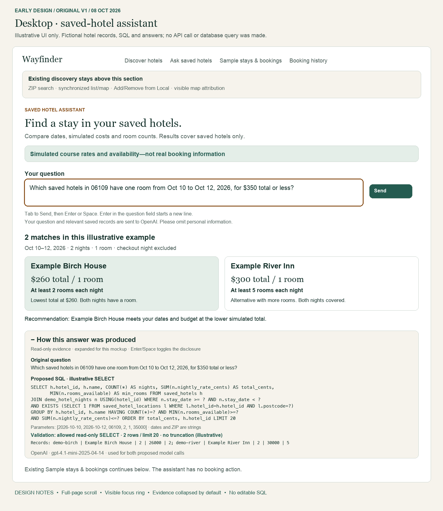
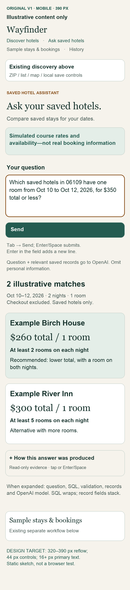
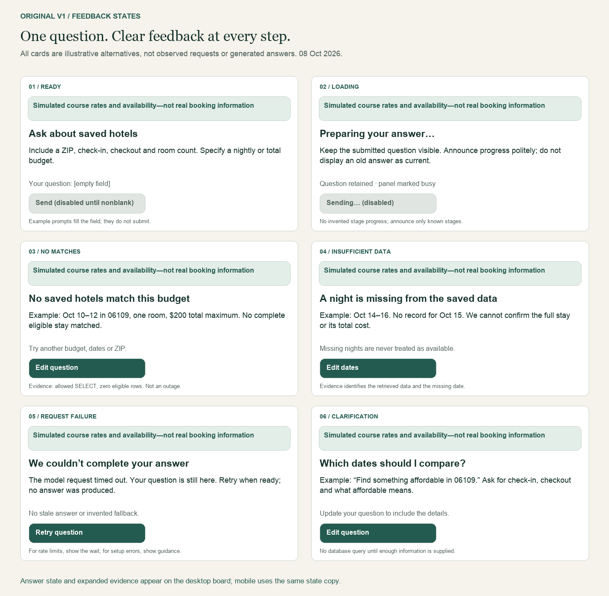

# Chatbot early design

**Original v1 — October 8, 2026, before chatbot implementation.**
Based on the [plan](chatbot-plan.md), [provider research](chatbot-research.md),
and existing Vue layout/styles. These are static design images with fictional
examples, not screenshots of implemented functionality or live model evidence.

## Original images

## Placement and interaction

Add an “Ask saved hotels” anchor between discovery and sample stays. Keep the
existing ZIP search, list/map, Add/Remove controls, attribution, sample search,
bookings and history intact. Use the app's cream background, dark green text,
green buttons and serif headings; system Arial/Georgia approximate its DM Sans/
Fraunces fonts in these documentation renders, without downloading fonts.

The question has a visible label, followed by Send and a short disclosure that
the question and relevant saved records go to OpenAI. The assistant shows the
submitted question, matching hotels, stay dates, nights, per-room total,
minimum available rooms across the stay, and recommendation reason. Checkout
is excluded. No reservation action or real-availability claim appears here.

Keep **“Simulated course rates and availability—not real booking information”**
in every state, outside the changing answer/evidence content. It is persistent
within the section, not a floating overlay that could obscure controls on mobile.
Label the saved inventory as a subset, not all hotels in the ZIP.

Desktop uses adjacent answer cards; mobile stacks them, wraps navigation and
places a full-width Send button below the question. The mobile board represents
a 390 CSS-pixel full-page scroll at 2× resolution. Target reflow down to 320 px,
16 px primary text, 44 px controls and no page-wide horizontal scrolling.
This is a layout target, not a responsive-browser test.

## Keyboard and feedback

Use a labeled textarea: Enter inserts a newline; Tab reaches Send; Enter/Space
activates buttons. Keep visible focus rings (amber in the mockup), logical tab
order and native controls. Keep focus on the initiating control when results
arrive; announce concise status via a polite live region rather than forcing
focus into a long answer. “Edit question/dates” returns focus to the textarea.
Link validation feedback to the input; mark the result region busy while loading.

| State | Intended behavior |
| --- | --- |
| Ready | Explain useful inputs; disable empty submission. Any example prompt fills the field without sending. |
| Loading | Retain question; prevent repeated sends; clear obsolete answers. Announce only progress known by the frontend, not invented SQL/model stages. |
| Answer | Show dates, checked total, room counts and reason; preserve original question and corresponding evidence together. |
| No matches | Successful retrieval found no eligible saved stay; suggest changing budget/dates/ZIP without claiming no real hotels exist. |
| Insufficient data | Identify absent nights or incomplete evidence; do not infer availability or a full total. |
| Failure | Preserve input and show a safe cause. Retry for recoverable errors; respect rate-limit waits and distinguish configuration/billing guidance. No fake fallback answer. |
| Clarification | Ask for missing dates or budget meaning before retrieval; invite a revised complete question. |

## Read-only evidence disclosure

Use native `details`/`summary`, collapsed by default; Enter/Space or tapping the
summary opens it. Desktop is drawn expanded to demonstrate contents; mobile
is drawn collapsed to show the normal reading flow. Include the original
question, proposed SQL and bound parameters, backend validation outcome,
retrieved records with column labels, row limit/truncation status, and provider/
model: OpenAI / `gpt-4.1-mini-2025-04-14`. Both model requests use that identifier.

SQL is selectable text, never an input or an Execute button. On mobile wrap
SQL and stack labeled record fields. Keep disclosure focus on its summary;
its contents follow normal reading order. On rejected queries, show rejection
and “not executed”; on pre-query failures mark later stages “not reached”.
Show only sanitized evidence, no secrets or raw provider exception dumps.

The fictional records `demo-birch` / Example Birch House and `demo-river` /
Example River Inn are **design placeholders only**. The illustrative question
requests one room, October 10–12, 2026, ZIP 06109, at most $350 total. Displayed
aggregates are respectively 2 nights / 26000 cents / minimum 2 rooms and
2 nights / 30000 cents / minimum 5 rooms. The recommendation follows those
aggregates; the drawing makes no claim about individual nightly prices.
SQL illustrates a date-range join and ZIP `EXISTS` check to avoid duplicating
nights through location associations. This is not the final SQL contract or
proof of its runtime validation. No placeholder records were added to SQLite.

## Preservation and review

Keep all three v1 PNGs unchanged after this design stage. Save future revisions
as v2/v3 and record deviations in [the separate change log](chatbot-design-changes.md).
The [documentation renderer](render-chatbot-mockup.py) refuses to overwrite any
existing v1 output. It uses the already bundled Pillow runtime, not a new app
dependency. Example content is confined to design artifacts, not Vue records.

All three boards were visually inspected. Draft review corrected unsupported
disclosure glyphs and removed nightly-price breakdowns not present in the shown
aggregate evidence. PNG integrity, local links, original-file hashes and the
renderer overwrite guard were checked. No app code/dependencies/data changed.
Keyboard, screen-reader, mobile browser, SQL safety and live OpenAI behavior
remain to be tested during implementation. No tests or services were run for
this documentation-only design stage.
