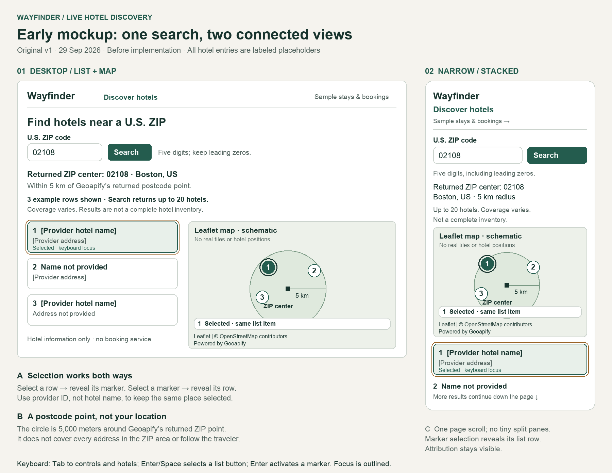
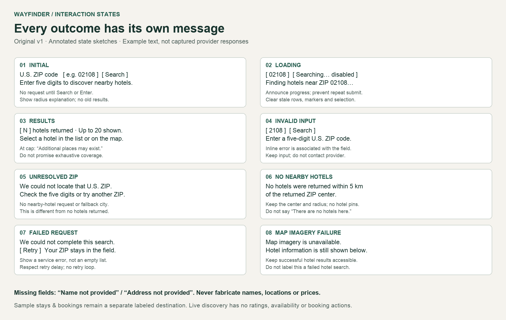

# Live hotel discovery — early design

**Original v1, September 29, 2026. Created before live hotel/map implementation.**

This design follows [the research](live-hotel-research.md) and [acceptance plan](live-hotel-plan.md). It is a static annotated mockup, not a working Leaflet interface or evidence of live hotel results.

## Original mockup

Hotel names and addresses are explicitly labeled placeholders. The three numbered entries demonstrate selection and missing fields; they are not fabricated provider records or an expected live count. The ZIP example uses `02108` and Boston, consistent with earlier geocoding evidence, but no fresh provider request was made for this mockup. Map positions are schematic, not geographic coordinates. Attribution text illustrates placement; the final application must supply working attribution links and real map tiles.

## Layout and navigation

- **Desktop:** labeled ZIP form and returned center above a side-by-side hotel list and map. Both views remain visible when an item is selected. The result summary shows the returned count, the 20-result cap, and coverage limitations.
- **Narrow screens:** a single page scroll with the form, center, summary, compact map, then hotel list. Design target is approximately 390 CSS pixels, with reflow down to 320; the board is an enlarged sketch, not a measured responsive browser capture. Controls should have at least 44-pixel touch targets and inputs should remain readable without zooming. At tighter widths, Search may wrap below the input rather than compress either control.
- **Sample workflows:** a separate labeled “Sample stays & bookings” destination preserves the existing sample search and booking interactions. Live discovery never displays its prices, simulated confirmations, or booking actions. The navigation treatment is proposed; the application has not been changed.

## Search center and boundaries

The center is Geoapify's returned point for the exact requested U.S. postcode. Display the returned ZIP and locality/country when available. If locality is missing, retain the ZIP and country without inventing a city. The square in the map sketch denotes that center, while numbered circles denote hotel records.

The radius is **5,000 meters around the returned postcode point**. It is not the traveler's location, the user's map viewport, or all addresses in a ZIP polygon. Panning the map must not silently change this search. Do not request browser geolocation. An unresolved or mismatched postcode must never trigger a fallback-city hotel search.

## Selection and keyboard interaction

The selected list row and corresponding marker share number 1 and the word “Selected”; filled color and an outline reinforce the state. Display numbers help orientation, but actual selection identity must use the provider place ID, not the name or result index.

Selecting a row reveals its marker and selected detail; selecting a marker selects and reveals the matching row. On narrow screens, reveal the selected item in the stacked layout without losing the search context. Keep focus on the activated control unless a deliberate keyboard navigation action moves it; scrolling a matching item into view must not unexpectedly steal focus.

Use semantic list buttons with Enter/Space activation, tab-accessible markers with Enter activation, descriptive accessible names, and visible keyboard focus. The amber outer outline in the sketch denotes focus; the green selected state is separate. Search can be submitted with Enter. Announce loading/results/selection politely and associate field errors with the ZIP input. These are design requirements, not accessibility test results.

## Honest information and limits

- Missing names use “Name not provided”; missing addresses use “Address not provided”. Optional missing information does not become invented content.
- Use only genuine provider identifiers and usable coordinates. Never plot a hotel at the postcode center merely because its coordinates are absent. The later API contract must define transparent handling of unusable records; if none can be trusted, show a data error rather than an empty-success claim.
- Show “Up to 20 hotels” and “Coverage varies. Results are not a complete hotel inventory.” When the cap is reached, add “Additional places may exist.” Do not assert that more definitely exist or that a smaller result count is exhaustive.
- Do not display live-hotel prices, ratings, room availability, booking buttons, or confirmations. This feature supplies geographic information, not bookable inventory.

## State behavior

The second image preserves the original state sketches and proposed copy.

| State | Behavior and distinction |
| --- | --- |
| Initial | ZIP label, example, Search button, and radius explanation; no provider calls before submit. |
| Loading | Keep entered ZIP visible, announce progress, disable repeated submission, and clear stale hotel rows/markers/selection. |
| Results | Show returned center, honest records, selected list/map item, cap wording, and attribution. The illustrative three-row count is not a live expectation. |
| Invalid input | Explain the five-digit U.S. format next to the field; preserve leading zeros and make no provider call. |
| Unresolved ZIP | Explain that the requested U.S. ZIP could not be located; keep the entered value and invite correction. No fallback search or stale hotels. |
| No nearby hotels | Successful search with no hotels returned: retain center and radius, clear hotel markers, and avoid claiming no hotels exist in reality. |
| Failed request | Explicit service-failure message and Retry; preserve input, avoid empty-success wording, and respect rate-limit retry delays. No automatic retry loop. |
| Map imagery failure | Keep successfully retrieved hotel information accessible and show a separate map warning. A tile failure does not invalidate a successful hotel response. |

## Attribution and credentials

The sketches reserve a visible footer in both map layouts for Leaflet and linked OpenStreetMap contributor attribution, plus “Powered by Geoapify” near the supplied information. The final links should target the provider and copyright pages documented in the research. Do not hide attribution under selected-place details or below a clipped map frame.

The proposed OSM tile endpoint is keyless. Geoapify geocoding and Places requests remain behind FastAPI; its key stays in the backend's ignored `.env`, never in browser configuration or tile URLs. No credentials are present in these artifacts.

## Research decisions carried forward

| Research finding | Design response |
| --- | --- |
| OpenStreetMap made geographic context visible. | Explicit returned ZIP center and point-radius explanation. |
| Google Maps linked list selection, details, and a map marker. | One selected provider place drives both representations; verify both directions during implementation. |
| Search interfaces offer feedback when no match is found. | Separate invalid, unresolved, empty-success, and failed-request messages. |
| Missing offer data was not always a numeric value. | Honest missing-field labels; never manufacture equivalent data for our provider. |
| Provider coverage and result limits constrain searches. | Visible cap and incomplete-coverage wording. |
| Tile and API attribution requirements differ. | Reserve visible space for both map and Geoapify credits. |

## Preservation and verification

Keep `live-hotel-mockup-v1.png` and `live-hotel-states-v1.png` as the original pre-implementation design. Later revisions should use `v2`, `v3`, etc.; append dated changes here rather than replacing v1. The documentation-only [rendering source](render-live-hotel-mockup.py) refuses to overwrite the originals. It uses the existing bundled Pillow runtime and system Arial fonts; no application dependency was added.

Both PNGs were opened and visually inspected for text readability, selection correspondence, annotation placement, and visible credits. A draft marker placement overlapped the selected-detail footer; it was moved before finalizing v1. All seven required states, plus a separate tile-error state, are covered. PNG file integrity and documentation links were checked. This is a static design review: live data, actual synchronization, responsive browser behavior, keyboard operation, and backend/frontend tests were not exercised in this stage. Application code, sample records, and running services remain unchanged.

### Design change log

| Date | Version | Change |
| --- | --- | --- |
| September 29, 2026 | Original v1 | Desktop and stacked narrow layouts; linked selection, seven required states, missing-field examples, result cap, and attribution. No implementation deviations yet. |

### Implemented interface — September 29, 2026

Original v1 images are unchanged. The implementation follows the two-column
list/map layout, stacked map-first narrow layout, numbered selection, separate
sample workflow, and all state categories. The following practical refinements
were made after the static mockup:

- Discovery appears first on the existing page. Navigation anchors lead to
  “Discover hotels”, “Sample stays & bookings”, and the existing booking history;
  no router/dependency was added. The ZIP demonstration is also preserved.
- The map is sticky on desktop, 450 px tall, and 310 px on narrow screens. The
  full page scrolls; no nested list scroller. Search wraps at narrow widths.
- Selected details sit below the map, outside its attribution area. The active
  marker uses a filled numbered circle, border ring, and `aria-pressed` state;
  no provider HTML is inserted in Leaflet popups. Names render as text.
- A “Show search area” button restores the 5 km circle after selection/panning.
  Selecting even the already-selected row recenters its marker. Both Enter and
  Space activate markers; list controls are native buttons. Marker selection
  reveals its list row without changing focus; narrow-screen list selection
  scrolls the map into view while retaining focus on the list button.
- Returned numeric center coordinates and omission/duplicate counts supplement
  the mockup's ZIP/locality and coverage explanation. The live first Boston
  record lacked a name and correctly displayed “Name not provided”.
- Editing the ZIP immediately aborts/invalidates pending work and removes old
  results. Repeated submits are disabled while pending. A 25-second client
  timeout and retry-delay countdown complement the backend's bounded requests.
- Map tile failures display a persistent warning for that result view; the
  successful hotel information remains usable. A new search creates a fresh map.

Two implementation defects were found and corrected by browser verification:
Leaflet needed an initial view before reading marker elements, and custom
markers needed explicit Enter activation. Additional test-only corrections
scoped list/marker locators, waited for Vue updates, allowed subpixel scroll
rounding, and reloaded before simulating tile failure to avoid decoded tile reuse.

Evidence: [controlled desktop](live-hotel-ui-controlled-desktop.png),
[controlled 390px](live-hotel-ui-controlled-mobile.png),
[tile failure](live-hotel-ui-tile-failure.png), and
[live 02108](live-hotel-ui-live-02108.png). Controlled images contain labeled
fixture data and blank test tiles; the live image contains actual provider
records and OSM imagery observed at 20:24 Eastern on September 29. All were
produced by browser checks, separate from the preserved original mockup.
See [verification](live-hotel-verification.md) for results and limitations.

## Student refinement — September 29, 2026, 20:59 EDT

The student requested one ZIP search box in the live hotel discovery area.
Removed the separate ZIP demo panel from `App.vue`; the discovery form now
serves as the sole ZIP lookup and shows the returned center with nearby hotels.
The legacy ZIP API and component source remain preserved. Sample city/hotel
search and bookings remain separate. No dependency or backend change.
